# Athena — UML Diagrams

> **Version:** 1.0  
> **Date:** April 2026  

---

## 1. System Architecture Diagram

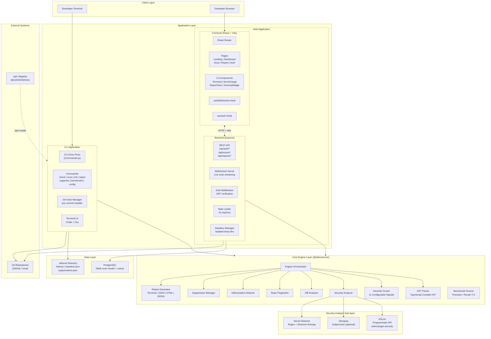

---

## 2. ER Diagram

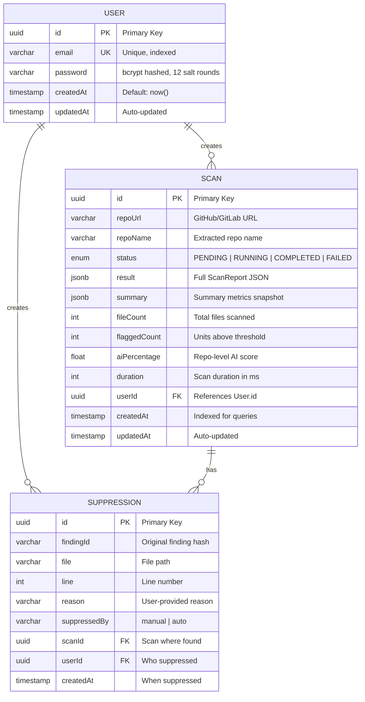

---

## 3. Use Case Diagram

```mermaid
flowchart TD
    subgraph ACTORS["Actors"]
        DEV["Developer<br/>(CLI User)"]
        WEBUSER["Web User<br/>(Browser)"]
        GITSERVER["Git Server<br/>(GitHub/GitLab)"]
        SEMGREP_BIN["Semgrep<br/>(Optional Tool)"]
    end

    subgraph UC_CLI["CLI Use Cases"]
        UC1["UC1: Scan Files<br/>athena scan ./src"]
        UC2["UC2: Check Staged Files<br/>athena check (diff-aware)"]
        UC3["UC3: Install Pre-commit Hook<br/>athena init"]
        UC4["UC4: Remove Pre-commit Hook<br/>athena uninstall"]
        UC5["UC5: View Report<br/>athena report"]
        UC6["UC6: View Trend<br/>athena report --trend"]
        UC7["UC7: Suppress Finding<br/>athena suppress id"]
        UC8["UC8: Run Benchmark<br/>athena benchmark"]
        UC9["UC9: Configure Settings<br/>athena config"]
        UC10["UC10: Profile Performance<br/>athena scan --profile"]
    end

    subgraph UC_WEB["Web Use Cases"]
        UC11["UC11: Register Account"]
        UC12["UC12: Login"]
        UC13["UC13: Submit Repo URL for Scan"]
        UC14["UC14: View Live Scan Progress<br/>(Sandboxed Terminal)"]
        UC15["UC15: View Scan Report<br/>(Severity + AI Score)"]
        UC16["UC16: View Dashboard<br/>(History + Trends)"]
        UC17["UC17: View Risk Density"]
        UC18["UC18: Export Report<br/>(JSON / HTML / JSONL)"]
    end

    subgraph UC_CORE["Core Engine Use Cases (Internal)"]
        UC19["UC19: Parse AST<br/>Extract CodeUnits"]
        UC20["UC20: Score AI Likelihood<br/>11 Signals"]
        UC21["UC21: Run Security Analysis<br/>ESLint + Secrets"]
        UC22["UC22: Detect Hallucinated APIs"]
        UC23["UC23: Build Repo Baseline"]
        UC24["UC24: Classify Severity"]
        UC25["UC25: Generate Report"]
    end

    DEV --> UC1
    DEV --> UC2
    DEV --> UC3
    DEV --> UC4
    DEV --> UC5
    DEV --> UC6
    DEV --> UC7
    DEV --> UC8
    DEV --> UC9
    DEV --> UC10

    WEBUSER --> UC11
    WEBUSER --> UC12
    WEBUSER --> UC13
    WEBUSER --> UC14
    WEBUSER --> UC15
    WEBUSER --> UC16
    WEBUSER --> UC17
    WEBUSER --> UC18

    UC1 --> UC19
    UC2 --> UC19
    UC13 --> UC19
    UC19 --> UC20
    UC20 --> UC21
    UC21 --> UC24
    UC24 --> UC25

    UC13 -.->|"clone"| GITSERVER
    UC21 -.->|"optional"| SEMGREP_BIN
    UC22 -.-> UC21
    UC23 -.-> UC20
```

---

## 4. Sequence Diagrams

### 4.1 CLI Scan Flow

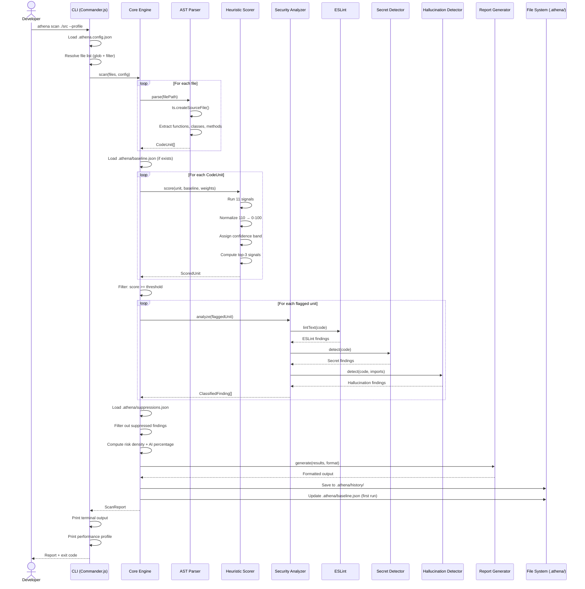

### 4.2 Pre-commit Hook Flow

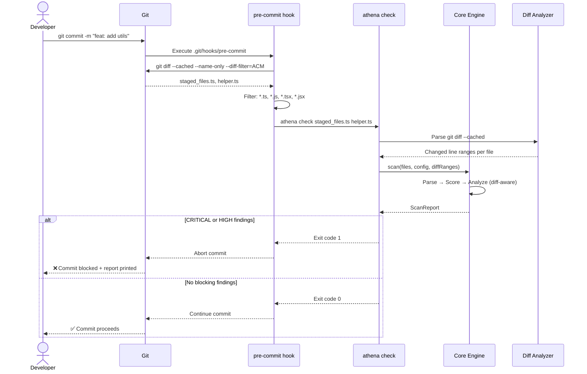

### 4.3 Web Scan Flow

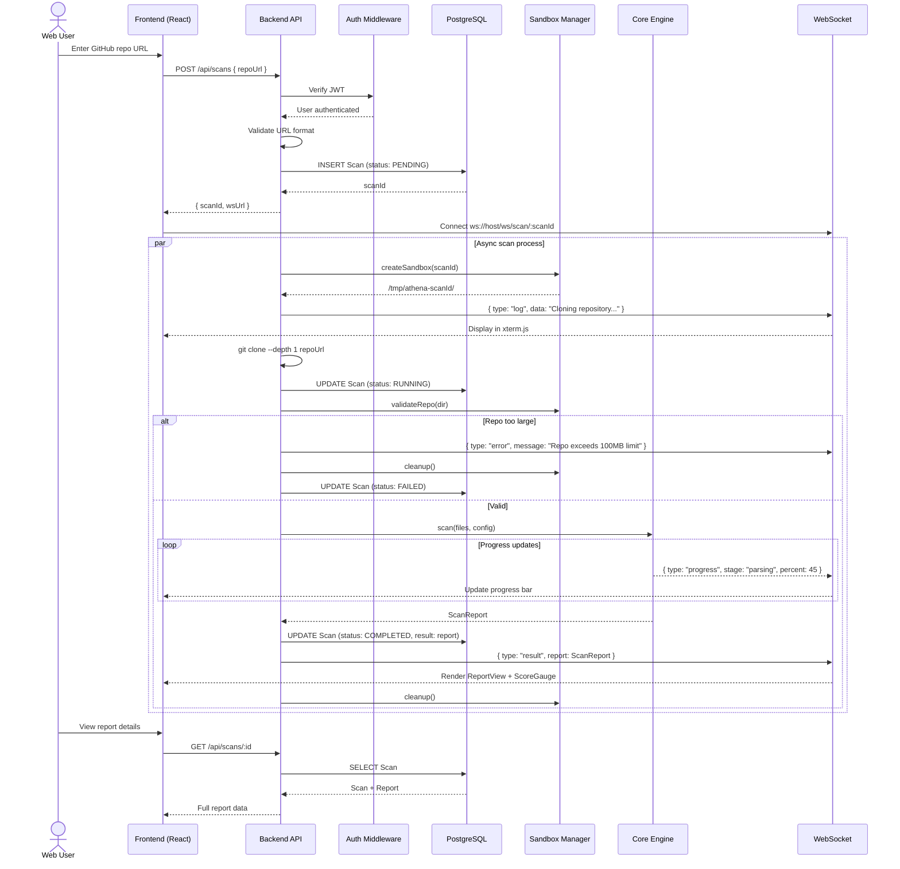

### 4.4 User Authentication Flow

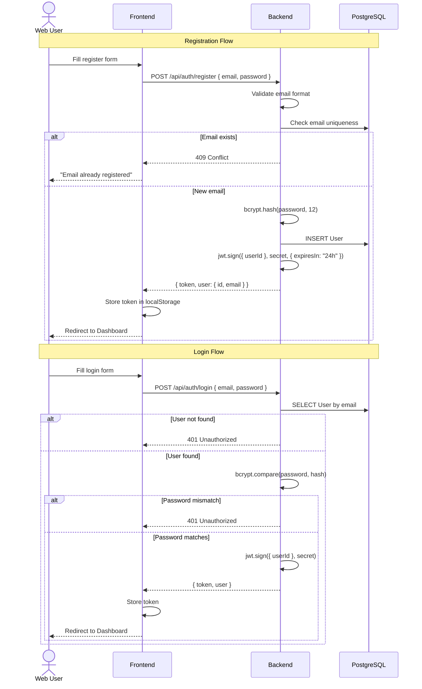

### 4.5 Suppression Flow

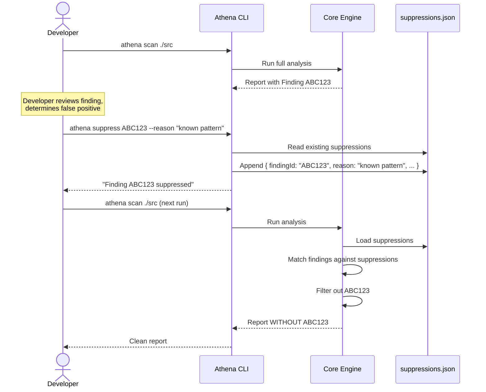

---

## 5. Activity Diagrams

### 5.1 Core Engine Pipeline Activity

```mermaid
flowchart TD
    START(("Start")) --> LOAD_CONFIG["Load Configuration<br/>.athena.config.json"]
    LOAD_CONFIG --> RESOLVE_FILES["Resolve File List<br/>Apply glob + exclude patterns"]
    RESOLVE_FILES --> DIFF_MODE{"Diff-Aware<br/>Mode?"}

    DIFF_MODE -->|Yes| PARSE_DIFF["Parse git diff<br/>Extract changed line ranges"]
    DIFF_MODE -->|No| PARSE_ALL["Use all files"]

    PARSE_DIFF --> PARSE_AST
    PARSE_ALL --> PARSE_AST

    PARSE_AST["Parse AST<br/>ts.createSourceFile()"]
    PARSE_AST --> EXTRACT["Extract CodeUnits<br/>Functions, Classes, Methods"]
    EXTRACT --> FILTER_SIZE{"LOC >= 3?"}
    FILTER_SIZE -->|No| SKIP_UNIT["Skip Unit"]
    FILTER_SIZE -->|Yes| CHECK_DIFF{"In diff<br/>range?"}

    CHECK_DIFF -->|"N/A (full mode)"| SCORE
    CHECK_DIFF -->|Yes| SCORE
    CHECK_DIFF -->|No| SKIP_UNIT

    SCORE["Run 11 Heuristic Signals"]
    SCORE --> NORMALIZE["Normalize Score<br/>110 → 0-100"]
    NORMALIZE --> BASELINE_CHECK{"Baseline<br/>exists?"}

    BASELINE_CHECK -->|Yes| DEVIATION["Compute Deviation<br/>from repo baseline"]
    BASELINE_CHECK -->|No| BAND

    DEVIATION --> BAND["Assign Confidence Band<br/>LOW | UNCERTAIN | HIGH"]
    BAND --> EXPLAIN["Compute Explainability<br/>Top 3 signals + % contribution"]
    EXPLAIN --> THRESHOLD{"Score >= Threshold?"}

    THRESHOLD -->|No| COLLECT_PASS["Add to unflagged results"]
    THRESHOLD -->|Yes| SECURITY_ANALYZE

    SECURITY_ANALYZE["Run Security Analysis"]
    SECURITY_ANALYZE --> ESLINT_RUN["ESLint Programmatic API"]
    SECURITY_ANALYZE --> SEMGREP_CHECK{"Semgrep<br/>installed?"}
    SECURITY_ANALYZE --> SECRET_RUN["Secret Detector<br/>Regex + Entropy"]
    SECURITY_ANALYZE --> HALLUC_RUN["Hallucination Detector<br/>Import/Call validation"]

    SEMGREP_CHECK -->|Yes| SEMGREP_RUN["Run Semgrep<br/>--config=auto"]
    SEMGREP_CHECK -->|No| SEMGREP_SKIP["Skip (graceful)"]

    ESLINT_RUN --> CLASSIFY
    SEMGREP_RUN --> CLASSIFY
    SEMGREP_SKIP --> CLASSIFY
    SECRET_RUN --> CLASSIFY
    HALLUC_RUN --> CLASSIFY

    CLASSIFY["Classify Severity<br/>Apply rule taxonomy"]
    CLASSIFY --> SUPPRESS_CHECK["Check Suppressions<br/>.athena/suppressions.json"]
    SUPPRESS_CHECK --> COLLECT_FLAGGED["Add to flagged results"]
    COLLECT_PASS --> AGGREGATE
    COLLECT_FLAGGED --> AGGREGATE
    SKIP_UNIT --> AGGREGATE

    AGGREGATE["Aggregate Results"]
    AGGREGATE --> COMPUTE_METRICS["Compute Metrics<br/>AI %, Risk Density,<br/>Confidence Distribution"]
    COMPUTE_METRICS --> TREND_CHECK{"History<br/>available?"}

    TREND_CHECK -->|Yes| COMPUTE_TREND["Compute Trend<br/>Direction + Change %"]
    TREND_CHECK -->|No| GENERATE_REPORT

    COMPUTE_TREND --> GENERATE_REPORT["Generate Report"]
    GENERATE_REPORT --> SAVE_HISTORY["Save to .athena/history/"]
    SAVE_HISTORY --> UPDATE_BASELINE["Update Baseline<br/>(first run only)"]
    UPDATE_BASELINE --> OUTPUT{"Output Format"}

    OUTPUT -->|Terminal| TERM_OUT["ANSI Terminal Output"]
    OUTPUT -->|JSON| JSON_OUT["JSON File"]
    OUTPUT -->|HTML| HTML_OUT["HTML Report"]
    OUTPUT -->|JSONL| JSONL_OUT["JSONL Export"]

    TERM_OUT --> DONE(("End"))
    JSON_OUT --> DONE
    HTML_OUT --> DONE
    JSONL_OUT --> DONE

    style START fill:#3b82f6,color:#fff
    style DONE fill:#3b82f6,color:#fff
    style SCORE fill:#8b5cf6,color:#fff
    style SECURITY_ANALYZE fill:#ef4444,color:#fff
    style CLASSIFY fill:#f97316,color:#fff
    style AGGREGATE fill:#06b6d4,color:#fff
```

### 5.2 Web Scan Activity

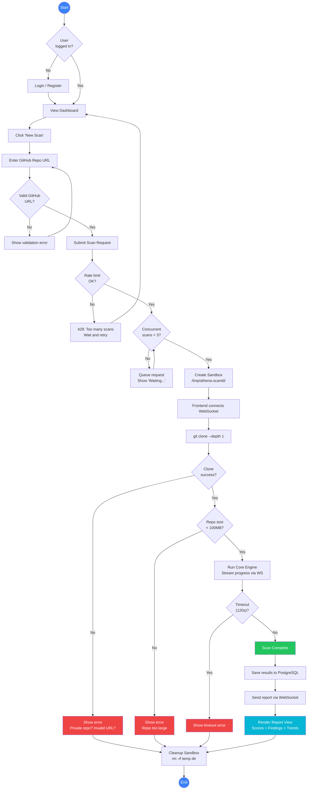

### 5.3 Heuristic Scoring Activity

```mermaid
flowchart TD
    START(("Start")) --> RECEIVE["Receive CodeUnit"]
    RECEIVE --> EXTRACT_META["Extract Metadata<br/>identifiers, comments, nesting"]

    EXTRACT_META --> S1["Signal 1: Generic Names<br/>Match against wordlist<br/>data, result, temp, item, value"]
    S1 --> S2["Signal 2: Comment Ratio<br/>commentLines / totalLines"]
    S2 --> S3["Signal 3: Obvious Comments<br/>Comment before x = y or return x"]
    S3 --> S4["Signal 4: Empty Catch<br/>catch block empty or console.error only"]
    S4 --> S5["Signal 5: Null Checks<br/>Redundant optional chaining / typeof"]
    S5 --> S6["Signal 6: Formatting Uniformity<br/>Indentation stdDev == 0"]
    S6 --> S7["Signal 7: Universal JSDoc<br/>Every function has preceding comment"]
    S7 --> S8["Signal 8: Naming Entropy<br/>Shannon entropy of identifier set"]
    S8 --> S9["Signal 9: Boilerplate Patterns<br/>CRUD template matching"]
    S9 --> S10["Signal 10: Helper Ordering<br/>Helpers defined before use"]
    S10 --> S11["Signal 11: Emoji in Comments<br/>Detect emoji chars in source"]

    S11 --> SUM["Sum weighted scores<br/>Max possible: 110"]
    SUM --> NORMALIZE["Normalize to 0-100 scale<br/>score = raw * 100 / 110"]

    NORMALIZE --> APPLY_BASELINE{"Repo baseline<br/>loaded?"}
    APPLY_BASELINE -->|Yes| ADJUST["Adjust score by<br/>deviation from baseline"]
    APPLY_BASELINE -->|No| CLASSIFY_BAND

    ADJUST --> CLASSIFY_BAND{"Score range?"}
    CLASSIFY_BAND -->|"0–40"| LOW["Band: LOW<br/>Likely human"]
    CLASSIFY_BAND -->|"40–70"| UNCERTAIN["Band: UNCERTAIN<br/>Needs review"]
    CLASSIFY_BAND -->|"70–100"| HIGH["Band: HIGH<br/>Likely AI"]

    LOW --> TOP3["Compute top 3 signals<br/>by contribution %"]
    UNCERTAIN --> TOP3
    HIGH --> TOP3

    TOP3 --> OUTPUT["Output: ScoredUnit<br/>score + band + explanation"]
    OUTPUT --> DONE(("End"))

    style START fill:#3b82f6,color:#fff
    style DONE fill:#3b82f6,color:#fff
    style LOW fill:#22c55e,color:#fff
    style UNCERTAIN fill:#eab308,color:#000
    style HIGH fill:#ef4444,color:#fff
```

### 5.4 Security Analysis Activity

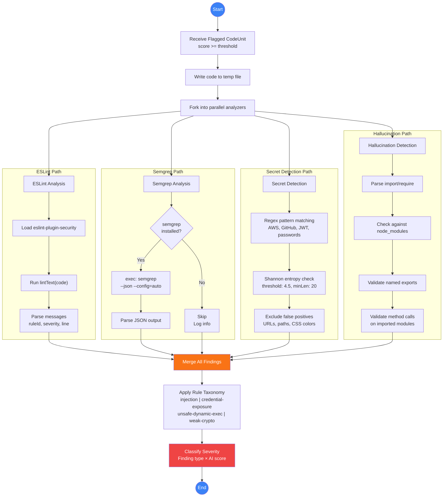

---

## 6. Diagram Index

| # | Diagram | Type | Section |
|---|---------|------|---------|
| 1 | System Architecture | Architecture | §1 |
| 2 | ER Diagram (User, Scan, Suppression) | ERD | §2 |
| 3 | Use Case Diagram | Use Case | §3 |
| 4 | CLI Scan Sequence | Sequence | §4.1 |
| 5 | Pre-commit Hook Sequence | Sequence | §4.2 |
| 6 | Web Scan Sequence | Sequence | §4.3 |
| 7 | User Authentication Sequence | Sequence | §4.4 |
| 8 | Suppression Flow Sequence | Sequence | §4.5 |
| 9 | Core Engine Pipeline Activity | Activity | §5.1 |
| 10 | Web Scan Activity | Activity | §5.2 |
| 11 | Heuristic Scoring Activity | Activity | §5.3 |
| 12 | Security Analysis Activity | Activity | §5.4 |
